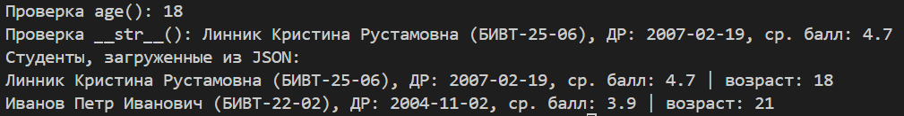
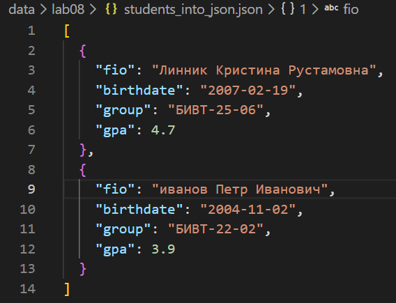

# Лабораторная работа №8
### Класс Student (models.py)
``` from dataclasses import dataclass, field
from datetime import datetime, date


@dataclass
class Student:
    fio: str
    birthdate: str
    group: str
    gpa: float

    def __post_init__(self):

        if not isinstance(self.fio, str):
            raise TypeError("ФИО должно быть строкой.")
        if not isinstance(self.birthdate, str):
            raise TypeError("Дата рождения должно быть строкой в формате YYYY-MM-DD.")
        if not isinstance(self.group, str):
            raise TypeError("Группа должно быть строкой (например SE-01).")
        if not isinstance(self.gpa, float):
            raise TypeError("Ср. балл должно быть числом (float).")

        try:
            datetime.strptime(self.birthdate, "%Y-%m-%d")
        except ValueError:
            raise ValueError("Дата рождения должно быть в формате ГГГГ-ММ-ДД.")

        if not (0 <= float(self.gpa) <= 5):
            raise ValueError("ср. балл должно быть числом от 0 до 5.")

    def age(self) -> int:
        birthday = datetime.strptime(self.birthdate, "%Y-%m-%d").date()
        today = date.today()
        years = today.year - birthday.year
        if (today.month, today.day) < (birthday.month, birthday.day):
            years -= 1
        return years

    def to_dict(self) -> dict:
        return {
            "fio": self.fio,
            "birthdate": self.birthdate,
            "group": self.group,
            "gpa": self.gpa,
        }

    @classmethod
    def from_dict(cls, d: dict):
        if not isinstance(d, dict):
            raise TypeError("Данные студента должен быть словарём.")

        required = {"fio", "birthdate", "group", "gpa"}
        if set(d.keys()) != required:
            raise ValueError(
                "Данные студента должен содержать ровно 4 поля: ФИО, дата рождения, группа, ср. балл."
            )

        return cls(
            fio=d["fio"],
            birthdate=d["birthdate"],
            group=d["group"],
            gpa=d["gpa"],
        )

    def __str__(self):
        return f"{self.fio} ({self.group}), ДР: {self.birthdate}, ср. балл: {self.gpa}"

```

### Модуль serialize.py
``` import json
from pathlib import Path
from models import *


def students_to_json(students, path):

    json_file = Path(path)

    if json_file.suffix.lower() != ".json":
        raise ValueError(f"Неверный формат выходного файла: ожидается .json")

    if not isinstance(students, list):
        raise TypeError("students должно быть списком объектов Student.")

    for s in students:
        if not isinstance(s, Student):
            raise TypeError("Все элементы списка должны быть объектами Student.")

    data = [s.to_dict() for s in students]

    with open(path, "w", encoding="utf-8") as f:
        json.dump(data, f, ensure_ascii=False, indent=2)


def students_from_json(path):

    json_file = Path(path)

    if json_file.suffix.lower() != ".json":
        raise ValueError(f"Неверный формат входного файла: ожидается .json")

    if not json_file.exists():
        raise FileNotFoundError("Файл не найден")

    with open(path, "r", encoding="utf-8") as f:
        try:
            data = json.load(f)
        except json.JSONDecodeError:
            raise ValueError("Файл не является корректным JSON.")

    if not isinstance(data, list):
        raise TypeError("JSON должен содержать список студентов.")

    students = []
    for item in data:
        if not isinstance(item, dict):
            raise TypeError("каждый студент в JSON должен быть словарём.")
        students.append(Student.from_dict(item))

    return students

```
Пример запуска:


Результат cериализации:




