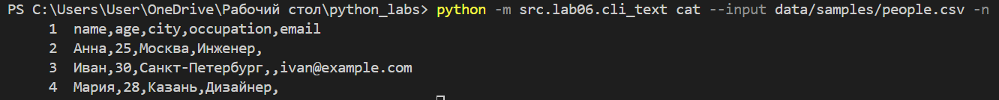
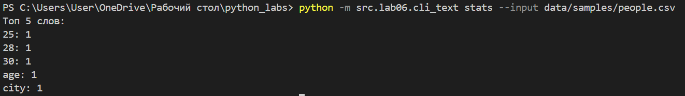
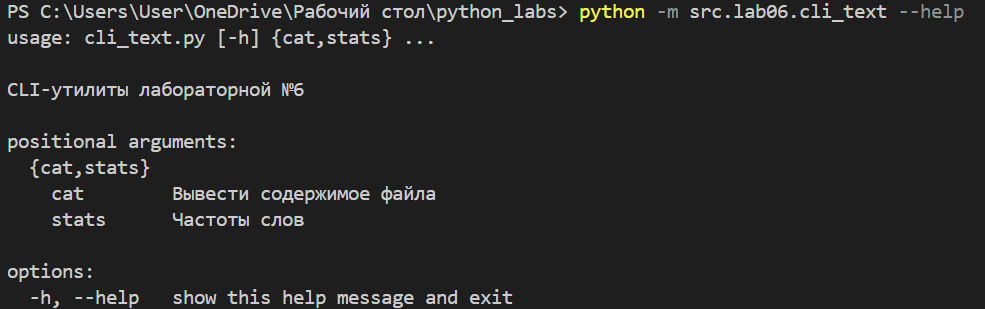
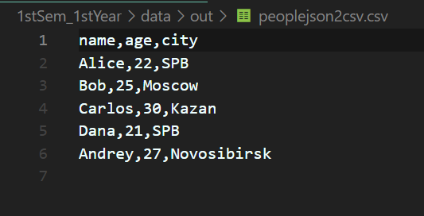
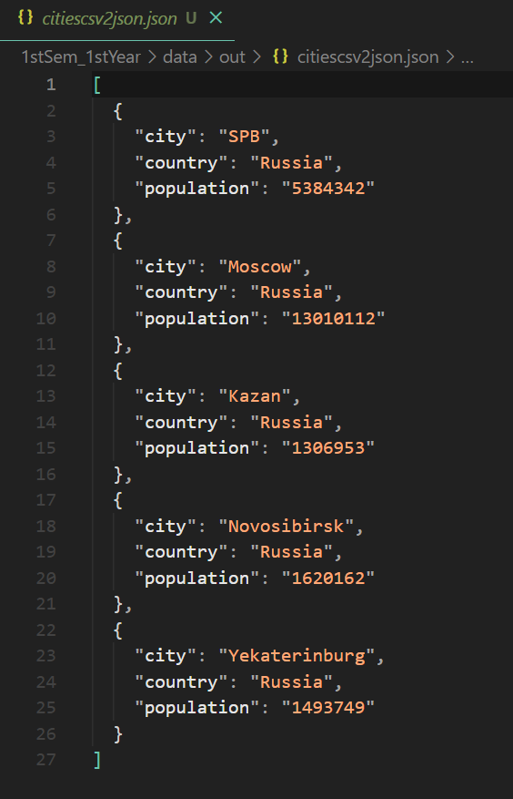
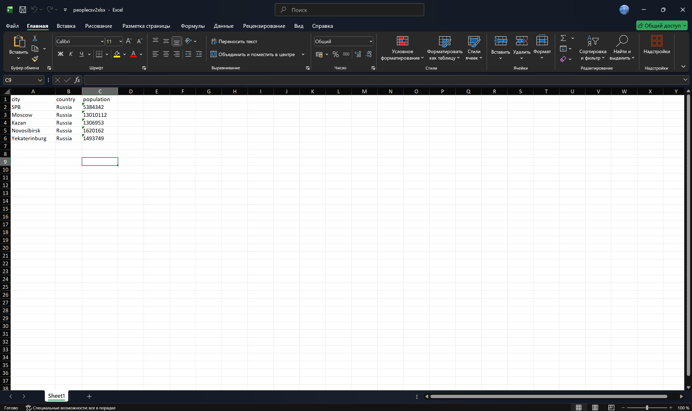
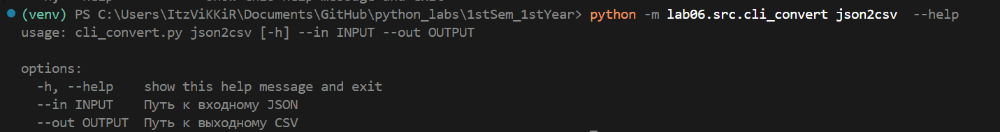

# Лабораторная работа №6
### Пример 1. Подкоманды в одном CLI
``` python
import argparse
from pathlib import Path
from lib.text import *


def main():
    parser = argparse.ArgumentParser(description="CLI‑утилиты лабораторной №6")
    subparsers = parser.add_subparsers(dest="command")

    # подкоманда cat 
    cat_parser = subparsers.add_parser("cat", help="Вывести содержимое файла")
    cat_parser.add_argument("--input", required=True, help="Путь к файлу для вывода")
    cat_parser.add_argument("-n", action="store_true", help="Нумеровать строки")

    # подкоманда stats 
    stats_parser = subparsers.add_parser("stats", help="Частоты слов")
    stats_parser.add_argument("--input", required=True, help="Путь к текстовому файлу")
    stats_parser.add_argument("--top", type=int, default=5, help="Количество топ-слов")

    args = parser.parse_args()

    file_path = Path(args.input)
    if not file_path.exists():
        parser.error(f"Файл '{args.input}' не найден")

    if args.command == "cat":
        try:
            with file_path.open("r", encoding="utf-8") as f:
                for i, line in enumerate(f, start=1):
                    line = line.rstrip("\n")
                    if args.n:
                        print(f"{i}: {line}")
                    else:
                        print(line)
        except Exception as e:
            parser.error(f"Ошибка при чтении файла: {e}")

    elif args.command == "stats":
        try:
            with file_path.open("r", encoding="utf-8") as f:
                text = f.read()
            
            normalized = normalize(text)
            words = tokenize(normalized)
            freq = count_freq(words)
            top_words = top_n(freq, args.top)

            if not top_words:
                print("Слова не найдены в файле")
                return

            print(f"Топ {args.top} слов:")
            for word, count in top_words:
                print(f"{word}: {count}")

        except Exception as e:
            parser.error(f"Ошибка при чтении файла: {e}")

    else:
        parser.print_help()

if __name__ == "__main__":
    main()
```



Меню помощи если не введена команда / --help



### Пример 2. CLI‑конвертер
``` python
import argparse
from lib.json_csv import *
from lib.csv_xlsx import *

def main():
    parser = argparse.ArgumentParser(description="Конвертер JSON↔CSV, CSV→XLSX")
    sub = parser.add_subparsers(dest="cmd")

    # json → csv
    json2csv_parser = sub.add_parser("json2csv")
    json2csv_parser.add_argument("--in", dest="input", required=True, help="Путь к входному JSON")
    json2csv_parser.add_argument("--out", dest="output", required=True, help="Путь к выходному CSV")

    # csv → json
    csv2json_parser = sub.add_parser("csv2json")
    csv2json_parser.add_argument("--in", dest="input", required=True, help="Путь к входному CSV")
    csv2json_parser.add_argument("--out", dest="output", required=True, help="Путь к выходному JSON")

    # csv → xlsx
    csv2xlsx_parser = sub.add_parser("csv2xlsx")
    csv2xlsx_parser.add_argument("--in", dest="input", required=True, help="Путь к входному CSV")
    csv2xlsx_parser.add_argument("--out", dest="output", required=True, help="Путь к выходному XLSX")

    args = parser.parse_args()

    input_path = Path(args.input)
    if not input_path.exists():
        parser.error(f"Входной файл '{args.input}' не найден")

    if args.cmd == "json2csv":
        json_to_csv(args.input, args.output)
    elif args.cmd == "csv2json":
        csv_to_json(args.input, args.output)
    elif args.cmd == "csv2xlsx":
        csv_to_xlsx(args.input, args.output)
    else:
        parser.print_help()


if __name__ == "__main__":
    main()
```




Меню помощи после введения подкоманды и --help

