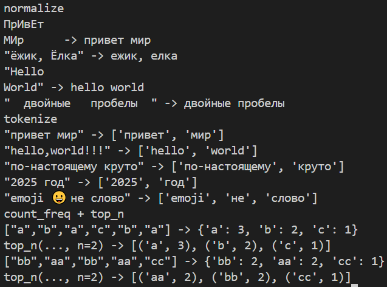
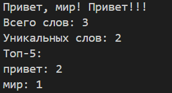

# **Лабораторная работа №3**
### **Задание №1**
```
import re
import unicodedata


def normalize(text: str, *, casefold: bool = True, yo2e: bool = True) -> str:
    """
    Нормализует текст:
    - Приводит к casefold (лучше чем lower для Юникода)
    - Заменяет буквы ё/Ё на е/Е
    - Убирает невидимые управляющие символы, заменяя их на пробелы
    - Схлопывает повторяющиеся пробелы в один
    """
    if casefold:
        text = text.casefold()
    
    if yo2e:
        text = text.replace('ё', 'е').replace('Ё', 'Е')
    
    # Заменяем управляющие символы и невидимые символы на пробелы
    text = ''.join(char if char.isprintable() or char.isspace() else ' ' for char in text)
    
    # Схлопываем множественные пробелы в один
    text = re.sub(r'\s+', ' ', text)
    
    # Убираем пробелы в начале и конце
    return text.strip()
print('normalize')
print("ПрИвЕт\nМИр\t ->", normalize("ПрИвЕт\nМИр\t"))
print("\"ёжик, Ёлка\" ->", normalize("ёжик, Ёлка"))
print("\"Hello\r\nWorld\" ->", normalize("Hello\r\nWorld"))
print("\"  двойные   пробелы  \" ->", normalize("  двойные   пробелы  "))


def tokenize(text: str) -> list[str]:
    
    # Регулярное выражение для поиска слов (буквы/цифры/подчёркивание + дефис внутри)
    pattern = r'[\w]+(?:-[\w]+)*'
    tokens = re.findall(pattern, text)
    
    return tokens
print('tokenize')
print("\"привет мир\" ->", tokenize(("привет мир")))
print("\"hello,world!!!\" ->", tokenize(("hello,world!!!")))
print("\"по-настоящему круто\" ->", tokenize(("по-настоящему круто")))
print("\"2025 год\" ->", tokenize(("2025 год")))
print("\"emoji 😀 не слово\" ->", tokenize(("emoji 😀 не слово")))

def count_freq(tokens: list[str]) -> dict[str, int]:
    """
    Подсчитывает частоты токенов
    """
    freq = {}
    for token in tokens:
        freq[token] = freq.get(token, 0) + 1
    return freq


def top_n(freq: dict[str, int], n: int = 5) -> list[tuple[str, int]]:
    """
    Возвращает топ-N токенов по убыванию частоты
    При равенстве частот - по алфавиту
    """
    # Сортируем сначала по убыванию частоты, затем по возрастанию слова (алфавиту)
    sorted_items = sorted(freq.items(), key=lambda x: (-x[1], x[0]))
    return sorted_items[:n]
print('count_freq + top_n')
print('["a","b","a","c","b","a"] ->', count_freq((["a","b","a","c","b","a"])))
print('top_n(..., n=2) ->', top_n(count_freq((["a","b","a","c","b","a"]))))
print('["bb","aa","bb","aa","cc"] ->', count_freq((["bb","aa","bb","aa","cc"])))
print('top_n(..., n=2) ->', top_n(count_freq((["bb","aa","bb","aa","cc"]))))
```


### **Задание №2**
```
from text import *
def text_stats(n: str):
    n=input()
    norm= normalize(n)
    tokens=tokenize(norm)
    freq=count_freq(tokens)
    print(f'Всего слов: {len(tokens)}')
    print(f'Уникальных слов: {len(freq)}')
    print(f'Топ-5:')
    top=top_n(freq)
    for word, value in top:
```


