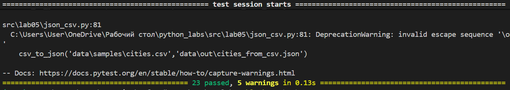
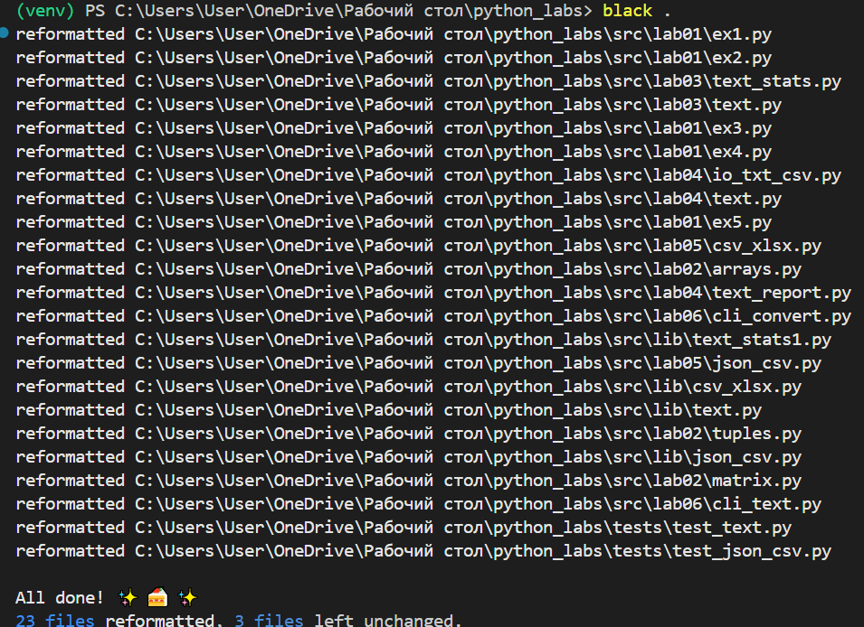

# Лабораторная работа №7
### Тесты для lib/text.py
``` python
import pytest
import sys
import os

sys.path.insert(0, os.path.abspath(os.path.join(os.path.dirname(__file__), "..")))

from lib.text import normalize, tokenize, count_freq, top_n


@pytest.mark.parametrize(
    "source, expected",
    [
        ("ПрИвЕт\nМИр\t", "привет мир"),  # обычный текст + спецсимволы
        ("ёжик, Ёлка", "ежик, елка"),  # буквы с разным регистром
        ("Hello\r\nWorld", "hello world"),  # английский текст
        ("  двойные   пробелы  ", "двойные пробелы"),  # лишние пробелы
        ("", ""),  # пустая строка
        ("\t\n   ", ""),  # только пробельные символы
    ],
)
def test_normalize(source, expected):
    assert normalize(source) == expected


@pytest.mark.parametrize(
    "source, expected",
    [
        ("привет мир", ["привет", "мир"]),  # обычный текст
        ("один, два, три!", ["один", "два", "три"]),  # спецсимволы и знаки препинания
        ("", []),  # пустая строка
        ("   много   пробелов   ", ["много", "пробелов"]),  # повторяющиеся пробелы
        ("слово слово слово", ["слово", "слово", "слово"]),  # повторяющиеся слова
    ],
)
def test_tokenize(source, expected):
    assert tokenize(source) == expected


@pytest.mark.parametrize(
    "tokens, expected",
    [
        (["a", "b", "a", "c", "b", "a"], {"a": 3, "b": 2, "c": 1}),
        ([], {}),
    ],
)
def test_count_freq(tokens, expected):
    assert count_freq(tokens) == expected


@pytest.mark.parametrize(
    "freq_dict, expected",
    [
        ({"a": 3, "b": 2, "c": 1}, [("a", 3), ("b", 2), ("c", 1)]),  # обычный случай
        (
            {
                "яблоко": 2,
                "апельсин": 2,
                "банан": 2,
            },  # одинаковые частоты → сортировка по алфавиту
            [("апельсин", 2), ("банан", 2), ("яблоко", 2)],
        ),
        ({}, []),  # пустой словарь
        (
            {
                "a": 5,
                "b": 4,
                "c": 3,
                "d": 2,
                "e": 1,
                "f": 1,
            },  # больше 5 элементов при n=5
            [("a", 5), ("b", 4), ("c", 3), ("d", 2), ("e", 1)],
        ),
    ],
)
def test_top_n(freq_dict, expected):
    assert top_n(freq_dict) == expected
```

### Тесты для lib/json_csv.py
``` python
import json
import csv
import pytest
from pathlib import Path
import sys
import os

sys.path.insert(0, os.path.abspath(os.path.join(os.path.dirname(__file__), "..")))
from lib.json_csv import json_to_csv, csv_to_json


def test_json_to_csv_roundtrip(tmp_path: Path):  # Успешная конвертация JSON to CSV
    src = tmp_path / "people.json"
    dst = tmp_path / "people.csv"

    data = [
        {"name": "Alice", "age": 22},
        {"name": "Bob", "age": 25},
    ]

    src.write_text(json.dumps(data, ensure_ascii=False), encoding="utf-8")

    json_to_csv(str(src), str(dst))

    with dst.open(encoding="utf-8") as f:
        rows = list(csv.DictReader(f))

    assert len(rows) == 2
    assert rows[0]["name"] == "Alice"
    assert rows[1]["age"] == "25"


def test_csv_to_json_roundtrip(tmp_path: Path):  # Успешная конвертация CSV to JSON
    src = tmp_path / "people.csv"
    dst = tmp_path / "people.json"

    with src.open("w", encoding="utf-8", newline="") as f:
        writer = csv.DictWriter(f, fieldnames=["name", "age"])
        writer.writeheader()
        writer.writerow({"name": "Alice", "age": "22"})
        writer.writerow({"name": "Bob", "age": "25"})

    csv_to_json(str(src), str(dst))

    data = json.loads(dst.read_text(encoding="utf-8"))

    assert isinstance(data, list)
    assert len(data) == 2
    assert data[0]["name"] == "Alice"
    assert data[1]["age"] == "25"


def test_json_to_csv_invalid_json(
    tmp_path: Path,
):  # Входной файл "сломан"/не является корректным файлом JSON
    src = tmp_path / "broken.json"
    dst = tmp_path / "output.csv"
    src.write_text("not a json", encoding="utf-8")

    with pytest.raises(ValueError):
        json_to_csv(str(src), str(dst))


def test_csv_to_json_invalid_csv(
    tmp_path: Path,
):  # Входной файл "сломан"/не является корректным файлом CSV
    src = tmp_path / "broken.csv"
    dst = tmp_path / "output.json"
    src.write_text(",,,\n,,", encoding="utf-8")

    with pytest.raises(ValueError):
        csv_to_json(str(src), str(dst))


def test_missing_file():  # Входного файла не существует
    with pytest.raises(FileNotFoundError):
        json_to_csv("no_such_file.json", "output.csv")


def test_invalid_suffix_to_json(tmp_path: Path):  # Входной файл не CSV
    src = tmp_path / "input.txt"
    dst = tmp_path / "output.json"
    src.write_text("This is 100% json, trust me", encoding="utf-8")
    with pytest.raises(ValueError):
        csv_to_json(str(src), str(dst))

```
Запуск автотестов через pytest


Проверка форматирования black --check .



