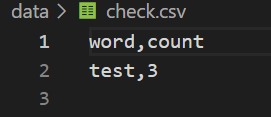
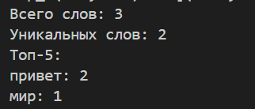
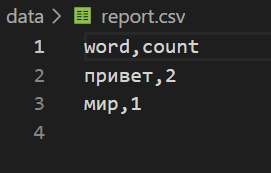
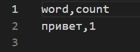

# **Лабораторная работа №4**
### **Задание №1**
```
from pathlib import Path
import csv
from typing import Iterable, Sequence
from collections import Counter
from text import normalize, tokenize
    txt = read_text("data/input.txt")   # возвращает содержимое файла как строку
    write_csv([("word", "count"), ("test", 3)], "data/check.csv")  # создаст CSV

def read_text(path: str | Path, encoding: str = "utf-8") -> str:
    p = Path(path)
    return p.read_text(encoding=encoding)


def ensure_parent_dir(path: str | Path) -> None:
    """
    Создать родительские директории для указанного пути, если их ещё нет.
    """
    p = Path(path)
    if p.parent and not p.parent.exists():
        p.parent.mkdir(parents=True, exist_ok=True)


def write_csv(
    rows: Iterable[Sequence], path: str | Path, header: tuple[str, ...] | None = None
) -> None:
    """
    Создать или перезаписать CSV-файл с разделителем ','.
    """
    p = Path(path)
    ensure_parent_dir(p)

    rows = list(rows)
    with p.open("w", newline="", encoding="utf-8") as f:
        w = csv.writer(f)
        if header is not None:
            w.writerow(header)
        for r in rows:
            w.writerow(r)


def frequencies_from_text(text: str) -> dict[str, int]:
    """
    Подсчитать частоты слов в тексте, используя normalize/tokenize из ЛР3
    """

    tokens = tokenize(normalize(text))
    return Counter(tokens)  # dict-like


def sorted_word_counts(freq: dict[str, int]) -> list[tuple[str, int]]:
    """
    Отсортировать пары (слово, частота):
      - сначала по убыванию частоты,
      - затем по алфавиту.
    """

    return sorted(freq.items(), key=lambda kv: (-kv[1], kv[0]))

if __name__ == "__main__":
    txt = read_text("data/input.txt")  # должен вернуть строку
    print(txt)
    write_csv([("word","count"),("test",3)], "data/check.csv") 
    print("CSV создан")
```


### **Задание №2**
```
import sys
from collections import Counter

try:
    from lab04.io_txt_csv import read_text, write_csv, ensure_parent_dir
except ImportError:
    #Альтернативный импорт для тестирования
    import os
    sys.path.append(os.path.dirname(os.path.dirname(__file__)))
    from lab04.io_txt_csv import read_text, write_csv, ensure_parent_dir
from lib.text import normalize, tokenize, count_freq, top_n

def frequencies_from_text(text: str) -> dict[str, int]:
    """
    Генерация частот из текста .
    """
    tokens = tokenize(normalize(text))
    return Counter(tokens)

def sorted_word_counts(freq: dict[str, int]) -> list[tuple[str, int]]:
    """
    Сортировка частот по шаблону: (-частота, слово).
    """
    return sorted(freq.items(), key=lambda kv: (-kv[1], kv[0]))

def generate_report():
    """
    Генерирует отчет по частотам слов.
    """
    input_file = "data/input.txt"
    output_file = "data/report.csv"
    
    try:
        # Чтение текста 
        text = read_text(input_file)
        
        # Подсчет частот через шаблонную функцию
        freq = frequencies_from_text(text)
        
        # Сортировка по шаблону
        sorted_words = sorted_word_counts(freq)
        
        # Сохранение отчета
        ensure_parent_dir(output_file)
        write_csv(sorted_words, output_file, header=("word", "count"))
        
        # Вывод статистики в консоль
        tokens = tokenize(normalize(text))
        print(f"Всего слов: {len(tokens)}")
        print(f"Уникальных слов: {len(freq)}")
        print("Топ-5:")
        
        for word, count in top_n(freq, 5):
            print(f"{word}: {count}")
            
    except FileNotFoundError:
        print(f"Ошибка: Файл {input_file} не найден")
        sys.exit(1)
    except UnicodeDecodeError:
        print(f"Ошибка: Неверная кодировка файла {input_file}")
        print("Попробуйте указать кодировку: read_text(path, encoding='ваша кодировка')")
        sys.exit(1)
    except Exception as e:
        print(f"Ошибка: {e}")
        sys.exit(1)

if __name__ == "__main__":
    generate_report()
```



