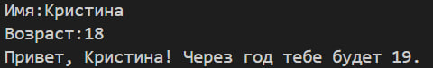
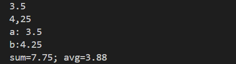
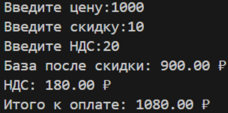
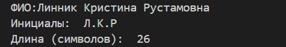

# **Лабораторная работа №1**
### **Задание №1**
#### Программа считает сколько лет будет пользователю через год
* Ввод: имя и возраст
* Вывод: приветствие и результат подсчета возраста через год

### **Задание №2**
#### Программа считает cумму введенных чисел и их среднее арифметическое
* Ввод: два вещественных числа a и b, допустима точка и запятая
* Вывод: сумма и среднее арифметическое данных чисел с двумя знаками после запятой

### **Задание №3**
#### Программа считает НДС и сумму покупки
* Ввод: 3 числа: цена, скидка и НДС
* Вывод: НДС и сумма покупки с учетом скидки

### **Задание №4**
#### Программа переводит минуты в формат ЧЧ:ММ
* Ввод: целые минуты
* Вывод: ЧЧ:ММ

### **Задание №5**
#### Программа выводит инициалы пользователя из ФИО и количество введенных символов
* Ввод: ФИО одной строкой
* Вывод: ФИО(верхний регист) и длина исходной строки
