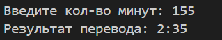

# **Лабораторная работа №1**
### **Задание №1**
#### Программа считает сколько лет будет пользователю через год
* Ввод: имя и возраст
* Вывод: приветствие и результат подсчета возраста через год
name=str(input("Имя:"))
age=int(input("Возраст:"))
print(f"Привет, {name}! Через год тебе будет {age+1}.")

### **Задание №2**
#### Программа считает cумму введенных чисел и их среднее арифметическое
* Ввод: два вещественных числа a и b, допустима точка и запятая
* Вывод: сумма и среднее арифметическое данных чисел с двумя знаками после запятой
number1=float(input().replace(',', '.'))
number2=float(input().replace(',', '.'))
sum=number1+number2
avg=(number1+number2)/2
print(f"a: {number1}")
print(f"b:{number2}")
print(f"sum={sum}; avg={round(avg,2)}")

### **Задание №3**
#### Программа считает НДС и сумму покупки
* Ввод: 3 числа: цена, скидка и НДС
* Вывод: НДС и сумма покупки с учетом скидки
price=float(input())
discount=float(input())
vat=float(input())
base = price * (1 - discount/100)
vat_amount = base * (vat/100)
total = base + vat_amount
print(f'База после скидки: {"{:.2f}".format(base)} ₽')
print(f'НДС: {"{:.2f}".format(vat_amount)} ₽')
print(f'Итого к оплате: {"{:.2f}".format(total)} ₽')

### **Задание №4**
#### Программа переводит минуты в формат ЧЧ:ММ
* Ввод: целые минуты
* Вывод: ЧЧ:ММ
print("Добро пожаловать в переводчик минут.")
print("Данный код переводит минуты в формат ЧЧ:ММ.")
m=int(input('Введите кол-во минут: '))
hours=m//60
minutes=m%60
print(f'Результат перевода: {hours}:{minutes}')

### **Задание №5**
#### Программа выводит инициалы пользователя из ФИО и количество введенных символов
* Ввод: ФИО одной строкой
* Вывод: ФИО(верхний регист) и длина исходной строки
print('инициалы')
fullname=str(input('ФИО:'))
name=fullname.split(' ')
newname=[new for new in name if new]
initials=[newname[num][0].upper() for num in range(len(newname))]
print('Инициалы: ','.'.join(initials))
print('Длина (символов): ',len(' '.join(newname)))

